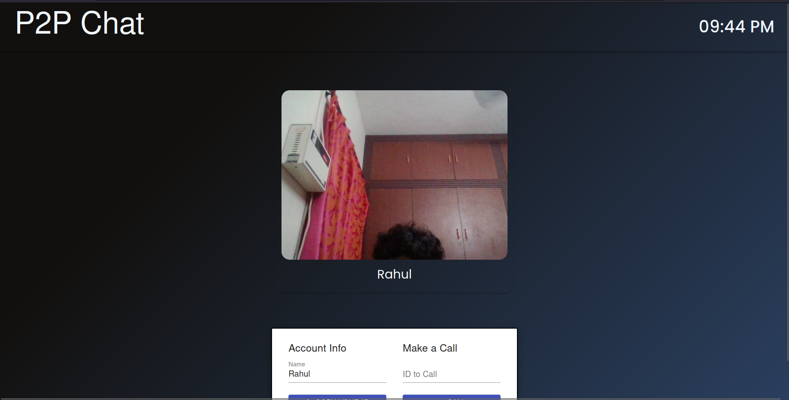
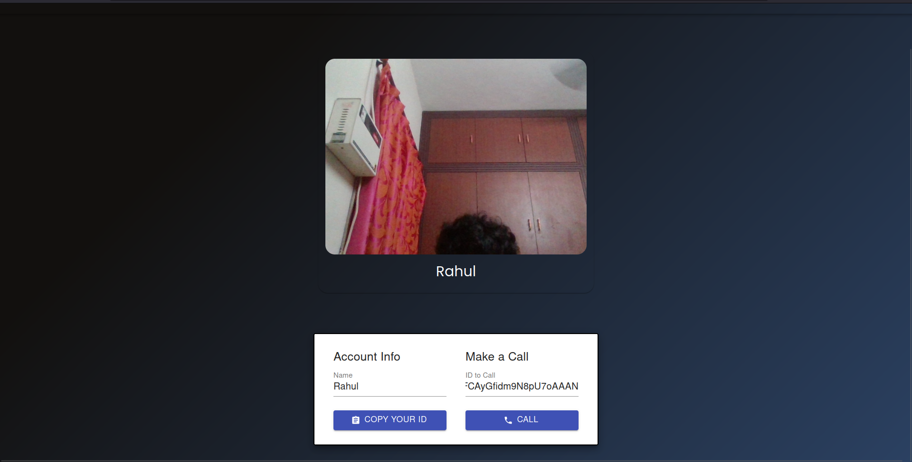
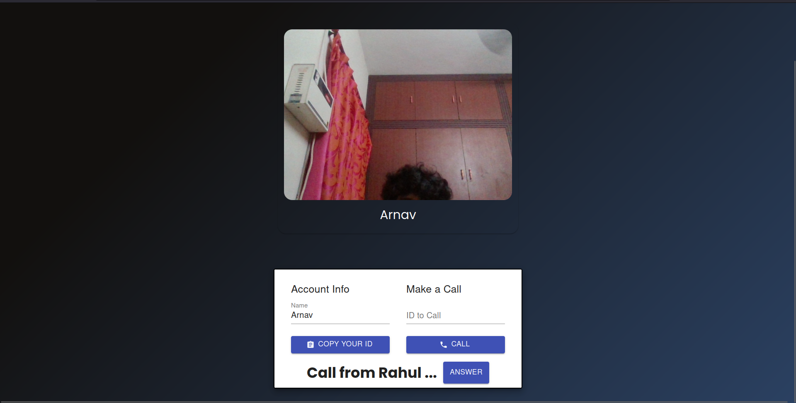
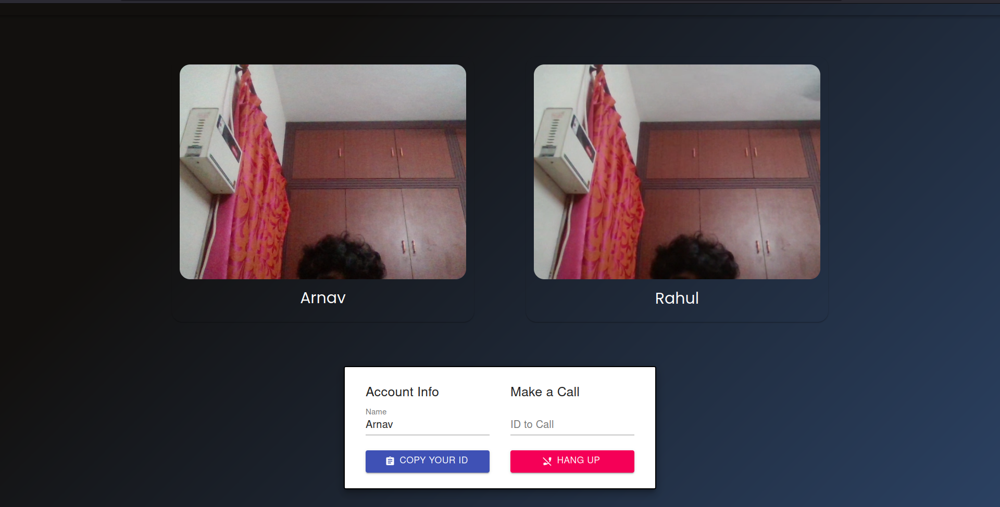

# Peer-to-Peer Video Chat Application
A simple peer to peer video chat application capable of communication between two users, using WebRTC.

## Frameworks Used
* ReactJS
* simple-peer
* socket.io
* CSS for styling

## Outputs

### Single User View

### Recieving a Call

### Video Chat View

